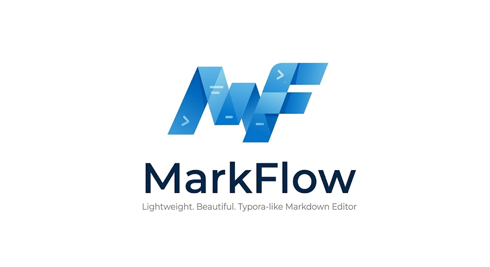

<div align="center">

<br/>



# MarkFlow

**Redefine Your Markdown Writing Experience**

*A lightweight, distraction-free WYSIWYG Markdown editor — crafted for those who value clarity.*

<br/>

[](LICENSE)
[](https://www.electronjs.org/)
[](https://react.dev/)
[](https://codemirror.net/)
[](https://www.typescriptlang.org/)

<br/>

[`下载安装`](#-下载安装) · [`功能特性`](#-功能特性) · [`快捷键`](#-快捷键) · [`快速开始`](#-快速开始) · [`English`](#english)

<br/>

</div>

---

## ✦ 设计哲学

> *好的编辑器应当隐于无形。*

MarkFlow 摒弃传统的「源码 / 预览」分栏模式，通过 CodeMirror 6 的 Decoration 系统**直接在编辑器内渲染 Markdown**——光标所在行显示原始语法，其余区域无缝呈现富文本。写作，回归纯粹。

<div align="center">

| | |
|:---:|:---:|
| 🪶 **极简轻量** | ✍️ **沉浸体验** |
| 单文件分发，零依赖安装 | 类 Typora 实时渲染，语法标记自动隐匿 |
| 🎨 **精心打磨** | 🔓 **开放自由** |
| GitHub 风格双主题，每一像素都经过考量 | MIT 协议，代码完全透明，自由定制 |

</div>

---

## 📥 下载安装

| 平台 | 格式 | 状态 |
|:---:|:---:|:---|
| 🪟 Windows | `.exe` 便携版 | ✅ 可用 |
| 🍎 macOS | `.dmg` | 🔜 即将支持 |
| 🐧 Linux | `.AppImage` | 🔜 即将支持 |

> 💡 从 [GitHub Releases](https://github.com/gao972609504/markflow/releases) 获取最新版本，或 [从源码构建](#-快速开始)。

---

## 🌟 功能特性

<details open>
<summary><strong>📝 编辑体验</strong></summary>

- **所见即所得** — 输入即渲染，告别双栏切换
- **交互式表格** — 可视化单元格编辑，直觉操作
- **代码高亮** — 20+ 语言精确语法着色
- **数学公式** — KaTeX 驱动，行内与块级渲染
- **Callout 块** — 18 种提示框样式，适配多场景
- **Mermaid 图表** — 流程图、序列图、甘特图直接渲染
- **Wiki 链接** — `[[双链]]` 支持，知识图谱的基础
- **脚注** — `[^1]` 定义与引用，学术写作利器

</details>

<details open>
<summary><strong>📁 文件管理</strong></summary>

- **文件树** — 侧栏目录浏览，拖拽即操作
- **多标签页** — 拖拽排序、固定标签，多任务并行
- **全局搜索** — 跨文件内容检索，毫秒级响应
- **快速打开** — `Ctrl+P` 模糊匹配，瞬达目标文件
- **收藏夹** — 常用文档一键访问
- **会话恢复** — 重启后完整还原工作状态
- **自动保存** — 可配置延迟，告别意外丢失

</details>

<details open>
<summary><strong>🎯 写作辅助</strong></summary>

- **Focus 模式** — 聚焦当前段落，屏蔽干扰
- **打字机模式** — 光标行始终居中，保持最佳视线
- **禅模式** — 全屏沉浸，只剩你和文字
- **大纲导航** — 标题结构一览，快速跳转
- **字数目标** — 设定目标，进度追踪与提醒
- **番茄钟** — 内置专注计时器，科学写作
- **语音朗读** — TTS 朗读选中文本，解放双眼
- **阅读时间** — 自动估算，掌握节奏

</details>

<details open>
<summary><strong>🛠️ 编辑工具</strong></summary>

- **查找替换** — 正则 / 大小写 / 全词匹配
- **多光标** — `Ctrl+Alt+↑/↓`，批量编辑
- **代码折叠** — 按标题层级折叠，长文档管理
- **书签系统** — 行标记与跳转，精准定位
- **行排序** — 排序 / 反转 / 去重 / 编号
- **大小写** — UPPER · lower · Title Case
- **TOC 生成** — 自动创建目录
- **Snippet** — 自定义快捷输入模板

</details>

<details>
<summary><strong>🎨 个性化定制</strong></summary>

亮色 / 暗色双主题 · 字体大小调节 `Ctrl++/−` · 自定义字体 · 行号开关 · 自动换行 · Tab 宽度 · 标题自动编号 · 标签面板 · 拼写检查

</details>

---

## ⌨️ 快捷键

<details>
<summary><strong>📂 文件操作</strong></summary>

| 快捷键 | 功能 | 快捷键 | 功能 |
|:---:|---|:---:|---|
| `Ctrl+N` | 新建文件 | `Ctrl+O` | 打开文件 |
| `Ctrl+S` | 保存 | `Ctrl+W` | 关闭标签 |
| `Ctrl+P` | 快速打开 | `Ctrl+G` | 跳转到行 |
| `Ctrl+Shift+T` | 重开已关标签 | `Ctrl+Shift+H` | 全局搜索 |

</details>

<details>
<summary><strong>✏️ 格式化</strong></summary>

| 快捷键 | 功能 | 快捷键 | 功能 |
|:---:|---|:---:|---|
| `Ctrl+B` | **加粗** | `Ctrl+I` | *斜体* |
| `` Ctrl+` `` | `行内代码` | `Ctrl+Shift+X` | ~~删除线~~ |
| `Ctrl+H` | 查找替换 | `Ctrl+/` | 快捷操作 |

</details>

<details>
<summary><strong>🔧 编辑操作</strong></summary>

| 快捷键 | 功能 | 快捷键 | 功能 |
|:---:|---|:---:|---|
| `Alt+↑/↓` | 移动当前行 | `Ctrl+D` | 复制当前行 |
| `Ctrl+Shift+K` | 删除当前行 | `Ctrl+Enter` | 下方插入行 |
| `Ctrl+Alt+↑/↓` | 添加多光标 | `Ctrl+Shift+[/]` | 提升/降低标题 |
| `Ctrl+]/[` | 列表缩进/反缩进 | `Ctrl+Shift+T` | 插入表格 |
| `Tab` | 表格导航 / 展开 Snippet | `Enter` | 智能续行 |

</details>

<details>
<summary><strong>⚡ 高级功能</strong></summary>

| 快捷键 | 功能 | 快捷键 | 功能 |
|:---:|---|:---:|---|
| `Ctrl+1~4` | 折叠到标题层级 | `Ctrl+Shift+1` | 展开全部 |
| `Ctrl+Shift+U/L` | 大写/小写 | `Ctrl+Alt+T` | 标题大小写 |
| `F5~F8` | 排序/反转/去重/编号 | `F9` | 插入目录 |
| `Ctrl+F2` | 切换书签 | `F2/Shift+F2` | 上/下一个书签 |
| `Ctrl+Shift+F` | 格式化表格 | `Ctrl+Shift+S` | 文档统计 |

</details>

<details>
<summary><strong>👁 视图控制</strong></summary>

| 快捷键 | 功能 | 快捷键 | 功能 |
|:---:|---|:---:|---|
| `Ctrl+=/-` | 字体放大/缩小 | `Ctrl+0` | 重置字体 |
| `Ctrl+Shift+O` | 大纲面板 | `F11` | 禅模式 |
| `Ctrl+Shift+P` | 命令面板 | `Ctrl+Shift+/` | 快捷键参考 |

</details>

---

## 🚀 快速开始

**前置要求：** Node.js ≥ 18 · npm ≥ 9

```bash
git clone https://github.com/gao972609504/markflow.git
cd markflow
npm install

npm run dev          # 开发模式（热重载）
npm run build        # 生产构建
npm run preview      # 预览构建结果
```

**打包分发：**

```bash
npm run build:win    # Windows（NSIS + 便携版）
npm run build:mac    # macOS（DMG）
npm run build:linux  # Linux（AppImage）
```

---

## 🏗️ 技术架构

<div align="center">

| 技术 | 版本 | 职责 |
|:---|:---:|:---|
| [Electron](https://www.electronjs.org/) | 33 | 跨平台桌面应用框架 |
| [React](https://react.dev/) | 18 | 声明式 UI 渲染层 |
| [CodeMirror 6](https://codemirror.net/) | 6 | 核心编辑器引擎 |
| [Zustand](https://zustand-demo.pmnd.rs/) | 4 | 轻量级状态管理 |
| [KaTeX](https://katex.org/) | 0.16 | 数学公式渲染 |
| [highlight.js](https://highlightjs.org/) | 11 | 代码语法高亮 |
| [markdown-it](https://github.com/markdown-it/markdown-it) | 14 | Markdown 解析引擎 |

</div>

### 渲染原理

MarkFlow 的核心是一个**光标感知的实时渲染流水线**：

```
buildDecorations()
  ├── Line Decoration   → 标题层级 · 代码块背景 · 引用边框
  ├── Mark Decoration   → 加粗/斜体/代码样式 + 语法标记隐匿
  └── Widget Decoration → 图片预览 · 复选框控件 · 数学公式渲染
```

- **光标感知** — 仅光标行显示原始语法，其余区域渲染为富文本
- **视口优化** — 仅对可见行计算装饰，确保大文件流畅编辑
- **按需加载** — highlight.js 按需注册语言，包体积减少 36%

### 项目结构

```
markflow/
├── src/
│   ├── main/                    # Electron 主进程
│   ├── preload/                 # 预加载脚本（IPC 桥接）
│   └── renderer/                # 渲染进程（React）
│       ├── components/          # UI 组件层
│       ├── plugins/             # 编辑器扩展（装饰 · 主题 · Widget）
│       ├── store/               # Zustand 全局状态
│       └── styles/              # 设计系统与样式
├── resources/                   # 应用图标与资源
└── electron.vite.config.ts      # 构建配置
```

---

## 🗺️ 路线图

**✅ 已完成**

- [x] 所见即所得 Markdown 编辑
- [x] 交互式表格 + 可视化编辑
- [x] 代码块语法高亮（20+ 语言）
- [x] KaTeX 数学公式渲染
- [x] 文件树 · 多标签页 · 拖拽排序
- [x] Callout / Admonition 提示块（18 种）
- [x] 全局搜索 + 快速打开 + 命令面板
- [x] 大纲导航 · 书签 · 标签面板
- [x] Focus / 打字机 / 禅模式
- [x] 自动保存 + 会话恢复
- [x] 番茄钟 + 字数目标 + 语音朗读
- [x] 多光标 + 代码折叠 + 代码片段

**🔧 进行中**

- [ ] 导出 PDF / HTML
- [ ] 自定义主题编辑器
- [ ] 图片上传到图床

**📋 计划中**

- [ ] Vim 模式
- [ ] 多语言界面（i18n）
- [ ] 协作编辑（CRDT）
- [ ] 插件系统

---

## 🤝 参与贡献

我们欢迎一切形式的贡献——代码、文档、设计、建议。

1. **Fork** 本仓库
2. 创建特性分支：`git checkout -b feature/amazing-feature`
3. 提交改动：`git commit -m 'feat: add amazing feature'`
4. 推送分支：`git push origin feature/amazing-feature`
5. 发起 **Pull Request**

详见 [CONTRIBUTING.md](CONTRIBUTING.md)。

---

## 🙏 致谢

MarkFlow 的诞生离不开这些卓越的开源项目：

| 项目 | 贡献 |
|:---|:---|
| [CodeMirror 6](https://codemirror.net/) | 强大而优雅的编辑器框架 |
| [Electron](https://www.electronjs.org/) | 跨平台桌面应用基础设施 |
| [React](https://react.dev/) | 声明式 UI 渲染框架 |
| [KaTeX](https://katex.org/) | 极速数学公式渲染引擎 |
| [highlight.js](https://highlightjs.org/) | 代码语法高亮 |
| [markdown-it](https://github.com/markdown-it/markdown-it) | 高性能 Markdown 解析器 |

灵感来源：[Typora](https://typora.io/) — Markdown 写作体验的标杆。

---

<div align="center">

[](LICENSE)

**MarkFlow** — 让 Markdown 写作回归纯粹 ✦

Made with ♥ by [MarkFlow Contributors](https://github.com/gao972609504/markflow/graphs/contributors)

[⬆ 回到顶部](#markflow)

<br/>

---

<br/>

</div>

<div id="english">

<div align="center">

<br/>


# MarkFlow

**Redefine Your Markdown Writing Experience**

*A lightweight, distraction-free WYSIWYG Markdown editor — crafted for clarity.*

<br/>

[](LICENSE)
[](https://www.electronjs.org/)
[](https://react.dev/)
[](https://codemirror.net/)
[](https://www.typescriptlang.org/)

<br/>

[`Download`](#-download) · [`Features`](#-features) · [`Shortcuts`](#keyboard-shortcuts) · [`Quick Start`](#quick-start) · [`中文文档`](#markflow)

<br/>

</div>

---

## ✦ Design Philosophy

> *A great editor should be invisible.*

MarkFlow ditches the traditional split-pane approach. Powered by CodeMirror 6's Decoration system, it renders Markdown **directly inside the editor** — the active line reveals raw syntax while everything else displays polished rich text. Writing, distilled to its essence.

<div align="center">

| | |
|:---:|:---:|
| 🪶 **Minimal** | ✍️ **Immersive** |
| Single executable, zero dependencies | Typora-style live rendering, syntax auto-hides |
| 🎨 **Refined** | 🔓 **Open** |
| GitHub-inspired dual themes, pixel-perfect | MIT licensed, fully transparent, free to customize |

</div>

---

## 📥 Download

| Platform | Format | Status |
|:---:|:---:|:---|
| 🪟 Windows | `.exe` portable | ✅ Available |
| 🍎 macOS | `.dmg` | 🔜 Coming soon |
| 🐧 Linux | `.AppImage` | 🔜 Coming soon |

> 💡 Grab the latest release from [GitHub Releases](https://github.com/gao972609504/markflow/releases), or [build from source](#quick-start).

---

## 🌟 Features

<details open>
<summary><strong>📝 Editing Experience</strong></summary>

- **Live Rendering** — Type and see results instantly, no split-pane
- **Interactive Tables** — Visual cell editing, intuitive controls
- **Code Highlighting** — 20+ languages with precise syntax coloring
- **Math Formulas** — KaTeX-powered inline and block rendering
- **Callout Blocks** — 18 admonition styles for every scenario
- **Mermaid Diagrams** — Flowcharts, sequence diagrams, Gantt charts
- **Wiki Links** — `[[bidirectional]]` support for knowledge graphs
- **Footnotes** — `[^1]` definition and reference for academic writing

</details>

<details open>
<summary><strong>📁 File Management</strong></summary>

- **File Tree** — Sidebar directory browser with drag-and-drop
- **Multi-tab** — Drag reorder, pin tabs, multitask effortlessly
- **Global Search** — Cross-file content search, millisecond response
- **Quick Open** — `Ctrl+P` fuzzy match, instant file access
- **Favorites** — One-click access to pinned documents
- **Session Restore** — Full state recovery after restart
- **Auto-save** — Configurable delay, never lose your work

</details>

<details open>
<summary><strong>🎯 Writing Aids</strong></summary>

- **Focus Mode** — Highlight current paragraph, dim the rest
- **Typewriter Mode** — Cursor stays centered, optimal eye level
- **Zen Mode** — Fullscreen immersion, just you and the words
- **Outline** — Heading structure overview with quick navigation
- **Word Goal** — Set targets, track progress, stay motivated
- **Pomodoro Timer** — Built-in focus timer for structured writing
- **Text-to-Speech** — Read selection aloud, rest your eyes
- **Reading Time** — Auto-estimate, pace your content

</details>

<details open>
<summary><strong>🛠️ Editor Tools</strong></summary>

- **Find & Replace** — Regex / case-sensitive / whole word
- **Multi-cursor** — `Ctrl+Alt+↑/↓` for batch editing
- **Code Folding** — Fold by heading level, tame long documents
- **Bookmarks** — Mark lines and jump, precise navigation
- **Line Ops** — Sort / reverse / unique / number
- **Case Convert** — UPPER · lower · Title Case
- **TOC Insert** — Auto-generate table of contents
- **Snippets** — Custom quick-insert templates

</details>

<details>
<summary><strong>🎨 Customization</strong></summary>

Light / Dark dual themes · Font size `Ctrl++/-` · Custom fonts · Line numbers · Word wrap · Tab width · Heading numbering · Tag panel · Spell check

</details>

---

## ⌨️ Keyboard Shortcuts

<details>
<summary><strong>📂 File Operations</strong></summary>

| Shortcut | Action | Shortcut | Action |
|:---:|---|:---:|---|
| `Ctrl+N` | New file | `Ctrl+O` | Open file |
| `Ctrl+S` | Save | `Ctrl+W` | Close tab |
| `Ctrl+P` | Quick open | `Ctrl+G` | Go to line |
| `Ctrl+Shift+T` | Reopen closed tab | `Ctrl+Shift+H` | Global search |

</details>

<details>
<summary><strong>✏️ Formatting</strong></summary>

| Shortcut | Action | Shortcut | Action |
|:---:|---|:---:|---|
| `Ctrl+B` | **Bold** | `Ctrl+I` | *Italic* |
| `` Ctrl+` `` | `Inline code` | `Ctrl+Shift+X` | ~~Strikethrough~~ |
| `Ctrl+H` | Find & replace | `Ctrl+/` | Quick actions |

</details>

<details>
<summary><strong>🔧 Editing</strong></summary>

| Shortcut | Action | Shortcut | Action |
|:---:|---|:---:|---|
| `Alt+↑/↓` | Move line | `Ctrl+D` | Duplicate line |
| `Ctrl+Shift+K` | Delete line | `Ctrl+Enter` | Insert line below |
| `Ctrl+Alt+↑/↓` | Add cursor | `Ctrl+Shift+[/]` | Promote/demote heading |
| `Ctrl+]/[` | List indent/dedent | `Ctrl+Shift+T` | Insert table |
| `Tab` | Table nav / Snippet | `Enter` | Smart continuation |

</details>

<details>
<summary><strong>⚡ Advanced</strong></summary>

| Shortcut | Action | Shortcut | Action |
|:---:|---|:---:|---|
| `Ctrl+1~4` | Fold to heading level | `Ctrl+Shift+1` | Unfold all |
| `Ctrl+Shift+U/L` | UPPER / lower | `Ctrl+Alt+T` | Title Case |
| `F5~F8` | Sort/Rev/Uniq/Number | `F9` | Insert TOC |
| `Ctrl+F2` | Toggle bookmark | `F2/Shift+F2` | Next/Prev bookmark |
| `Ctrl+Shift+F` | Format table | `Ctrl+Shift+S` | Doc statistics |

</details>

<details>
<summary><strong>👁 View</strong></summary>

| Shortcut | Action | Shortcut | Action |
|:---:|---|:---:|---|
| `Ctrl+=/-` | Zoom in/out | `Ctrl+0` | Reset zoom |
| `Ctrl+Shift+O` | Outline panel | `F11` | Zen mode |
| `Ctrl+Shift+P` | Command palette | `Ctrl+Shift+/` | Shortcut reference |

</details>

---

## 🚀 Quick Start

**Prerequisites:** Node.js ≥ 18 · npm ≥ 9

```bash
git clone https://github.com/gao972609504/markflow.git
cd markflow
npm install

npm run dev          # Dev mode (hot reload)
npm run build        # Production build
npm run preview      # Preview build output
```

**Packaging:**

```bash
npm run build:win    # Windows (NSIS + Portable)
npm run build:mac    # macOS (DMG)
npm run build:linux  # Linux (AppImage)
```

---

## 🏗️ Architecture

<div align="center">

| Tech | Version | Role |
|:---|:---:|:---|
| [Electron](https://www.electronjs.org/) | 33 | Cross-platform desktop framework |
| [React](https://react.dev/) | 18 | Declarative UI rendering |
| [CodeMirror 6](https://codemirror.net/) | 6 | Core editor engine |
| [Zustand](https://zustand-demo.pmnd.rs/) | 4 | Lightweight state management |
| [KaTeX](https://katex.org/) | 0.16 | Math formula rendering |
| [highlight.js](https://highlightjs.org/) | 11 | Code syntax highlighting |
| [markdown-it](https://github.com/markdown-it/markdown-it) | 14 | Markdown parsing engine |

</div>

### How It Works

MarkFlow's core is a **cursor-aware live rendering pipeline**:

```
buildDecorations()
  ├── Line Decoration   → Heading levels · Code backgrounds · Blockquote borders
  ├── Mark Decoration   → Bold/italic/code styles + syntax marker hiding
  └── Widget Decoration → Image preview · Checkboxes · Math formula rendering
```

- **Cursor-aware** — Only the active line shows raw syntax; other lines render rich text
- **Viewport-optimized** — Decorations computed only for visible lines
- **Lazy loading** — highlight.js registers languages on demand (36% bundle reduction)

### Project Structure

```
markflow/
├── src/
│   ├── main/                    # Electron main process
│   ├── preload/                 # Preload scripts (IPC bridge)
│   └── renderer/                # Renderer process (React)
│       ├── components/          # UI component layer
│       ├── plugins/             # Editor extensions (decorations · theme · widgets)
│       ├── store/               # Zustand global state
│       └── styles/              # Design system & styles
├── resources/                   # App icons & assets
└── electron.vite.config.ts      # Build configuration
```

---

## 🗺️ Roadmap

**✅ Done**

- [x] Live rendering Markdown editor
- [x] Interactive tables with visual editing
- [x] Code block syntax highlighting (20+ languages)
- [x] KaTeX math formulas
- [x] File tree · Multi-tab · Drag reorder
- [x] Callout / Admonition blocks (18 types)
- [x] Global search + Quick open + Command palette
- [x] Outline · Bookmarks · Tag panel
- [x] Focus / Typewriter / Zen mode
- [x] Auto-save + Session restore
- [x] Pomodoro timer + Word goal + TTS
- [x] Multi-cursor + Code folding + Snippets

**🔧 In Progress**

- [ ] Export PDF / HTML
- [ ] Custom theme editor
- [ ] Image upload to hosting

**📋 Planned**

- [ ] Vim mode
- [ ] Multi-language UI (i18n)
- [ ] Collaborative editing (CRDT)
- [ ] Plugin system

---

## 🤝 Contributing

Contributions of all forms are welcome — code, docs, design, ideas.

1. **Fork** this repository
2. Create a feature branch: `git checkout -b feature/amazing-feature`
3. Commit changes: `git commit -m 'feat: add amazing feature'`
4. Push to branch: `git push origin feature/amazing-feature`
5. Open a **Pull Request**

See [CONTRIBUTING.md](CONTRIBUTING.md) for details.

---

## 🙏 Acknowledgments

MarkFlow is built on the shoulders of these outstanding open-source projects:

| Project | Contribution |
|:---|:---|
| [CodeMirror 6](https://codemirror.net/) | Powerful and elegant editor framework |
| [Electron](https://www.electronjs.org/) | Cross-platform desktop infrastructure |
| [React](https://react.dev/) | Declarative UI rendering framework |
| [KaTeX](https://katex.org/) | Blazing-fast math formula rendering |
| [highlight.js](https://highlightjs.org/) | Code syntax highlighting |
| [markdown-it](https://github.com/markdown-it/markdown-it) | High-performance Markdown parser |

Inspired by [Typora](https://typora.io/) — the gold standard for Markdown writing.

---

<div align="center">

[](LICENSE)

**MarkFlow** — Making Markdown writing pure again ✦

Made with ♥ by [MarkFlow Contributors](https://github.com/gao972609504/markflow/graphs/contributors)

[⬆ Back to top](#markflow)

</div>

</div>
